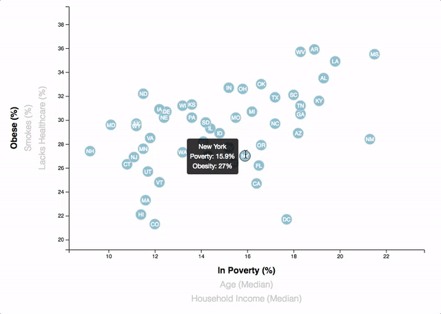

# Data Journalism and D3
D3 Visualization (Javascript)

## Background

Welcome to the newsroom! We've just accepted a data visualization position for a major metro paper. We're tasked with analyzing the current trends shaping people's lives, as well as creating charts, graphs, and interactive elements to help readers understand the findings.

The editor wants to run a series of feature stories about the health risks facing particular demographics. She's counting on us to sniff out the first story idea by sifting through information from the U.S. Census Bureau and the Behavioral Risk Factor Surveillance System.

The data set included with the assignment is based on 2014 ACS 1-year estimates: [https://factfinder.census.gov/faces/nav/jsf/pages/searchresults.xhtml](https://factfinder.census.gov/faces/nav/jsf/pages/searchresults.xhtml).  The current data set incldes data on rates of income, obesity, poverty, etc. by state. MOE stands for "margin of error."

## Task

### D3 Dabbler

You need to create a scatter plot between two of the data variables such as `Healthcare vs. Poverty` or `Smokers vs. Age`.

Using the D3 techniques, create a scatter plot that represents each state with circle elements. We'll code this graphic in the `app.js` file and pull in the data from `data.csv` by using the `d3.csv` function. Our scatter plot should ultimately appear like the image at the top of this section.

* Include state abbreviations in the circles.

* Create and situate the axes and labels to the left and bottom of the chart.

* Note: We are using `python -m http.server` to run the visualization. This will host the page at `localhost:8000` in the web browser.

- - -

### Dynamic Plots

Why make a static graphic when D3 lets you interact with your data?

#### 1. More Data, More Dynamics

We're going to include more demographics and more risk factors. Place additional labels in the scatter plot and give them click events so that the users can decide which data to display. Animate the transitions for the circles' locations as well as the range of the axes. 

#### 2. Incorporate d3-tip

While the ticks on the axes allow us to infer approximate values for each circle, it's impossible to determine the true value without adding another layer of data. Enter tooltips: developers can implement these in their D3 graphics to reveal a specific element's data when the user hovers their cursor over the element. We add tooltips to the circles and display each tooltip with the data that the user has selected. Use the `d3-tip.js` plugin developed by [Justin Palmer](https://github.com/Caged).

* Check out [David Gotz's example](https://bl.ocks.org/davegotz/bd54b56723c154d25eedde6504d30ad7) to see how to implement tooltips with d3-tip.

- - -
